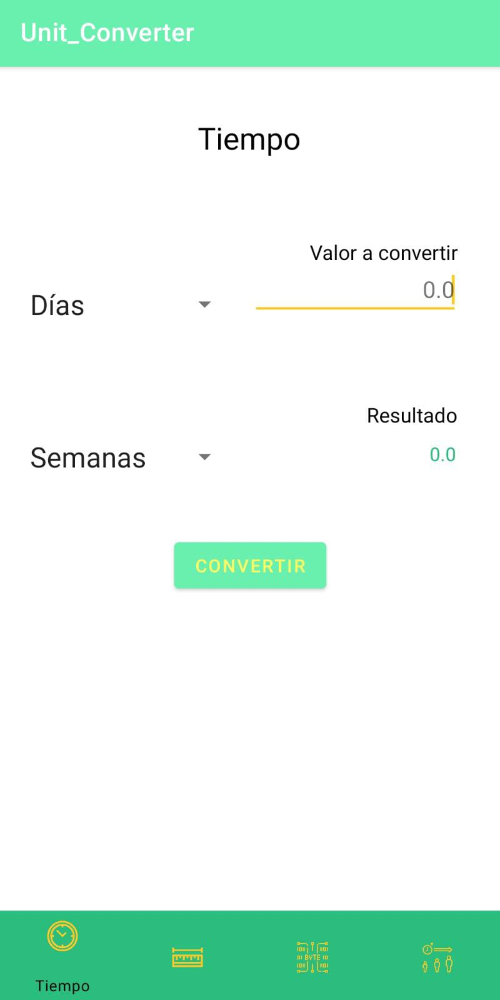
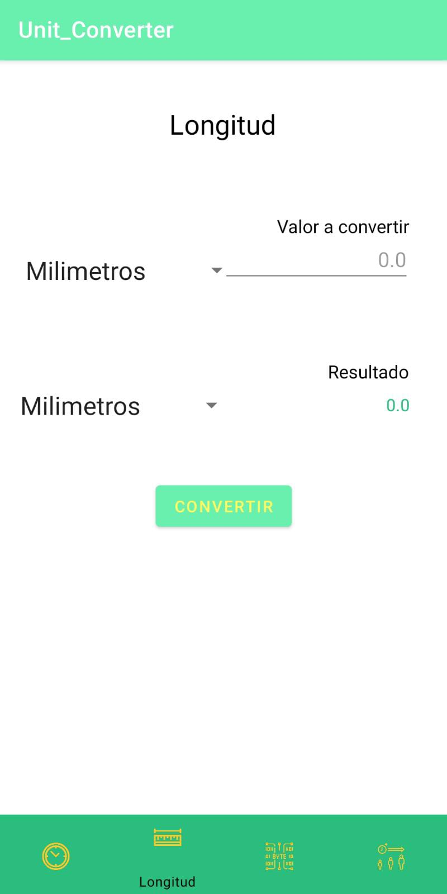
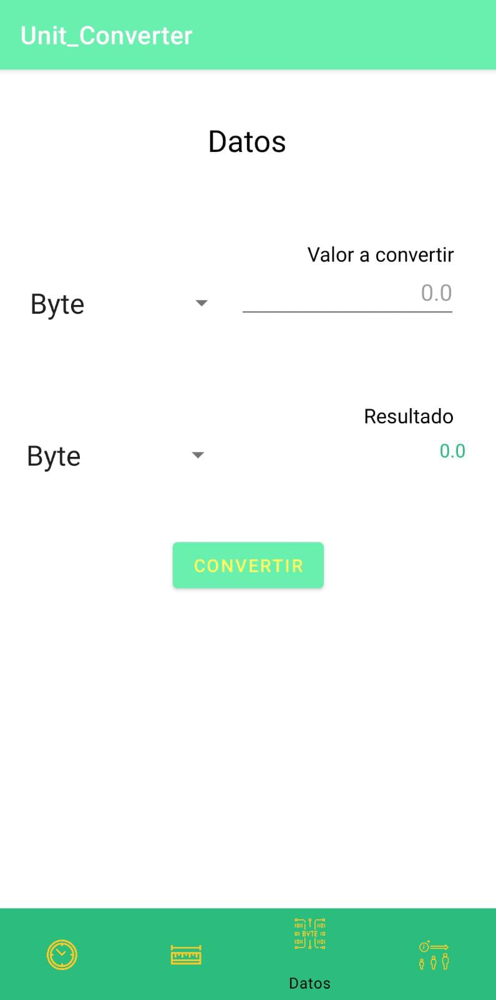
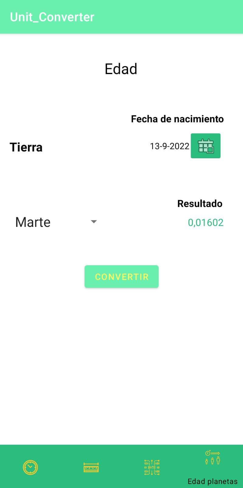

# Unit Converter APP

#### I have decided to create an application to convert lengths, data sizes, time and ages on different planets. To create the app I used kotlin, the official android documentation, gitHub and android studio.
#### If you want to try this application you can download the .apk file and install it on your mobile phone. 
¡¡¡Download
[Unit_converter](Apk/Unit_Converter.apk) !!!

1. To be able to choose what type of data we want to convert, I have created a menu at the bottom of the interface:

2. In this other interface we can convert units of time:
##### On this screen we can convert seconds, minutes, hours, days and weeks to each other, to do this we enter a value, select which units we want to convert and press the convert button.

3. Here we can see the length conversion interface:
##### On this screen we can convert millimeters, centimeters, decimeters, meters and kilometers among themselves, to do this we enter a value, select which units we want to convert and press the convert button.

4. The following screenshot shows the interface that is responsible for converting data sizes:
#### On this screen we can convert byte, kilobyte, megabyte, gigabyte and terabyte to each other, to do this we enter a value, select which units we want to convert and press the convert button.

5. Por último podemos ver la pantalla de cálculo de edad entre planetas que nos permete conocer cual sería nuentra edad en otros planetas:
#### On this screen we can calculate our age on the planets Earth, Mars, Mercury, Venus among themselves, to do this we enter our date of birth, select the planet we want to know our age from and press the convert button.

*Created by [SaraCorraless](https://github.com/SaraCorraless) with 💜*
